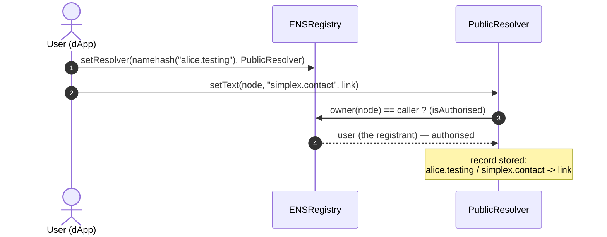
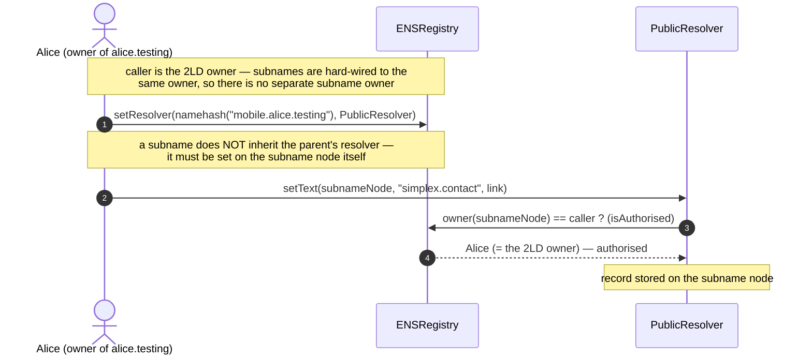
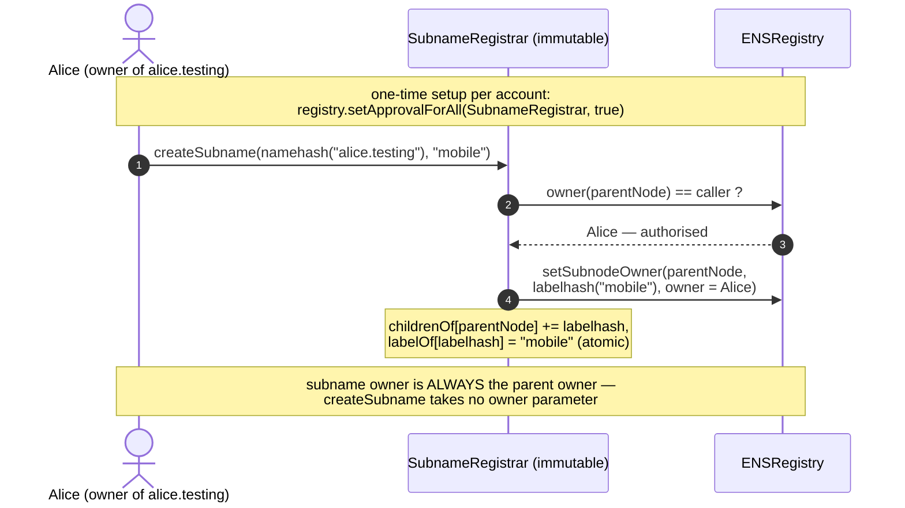
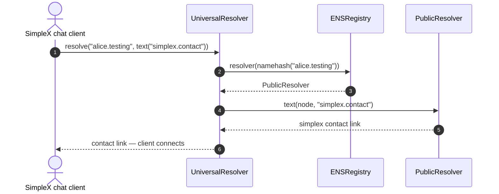
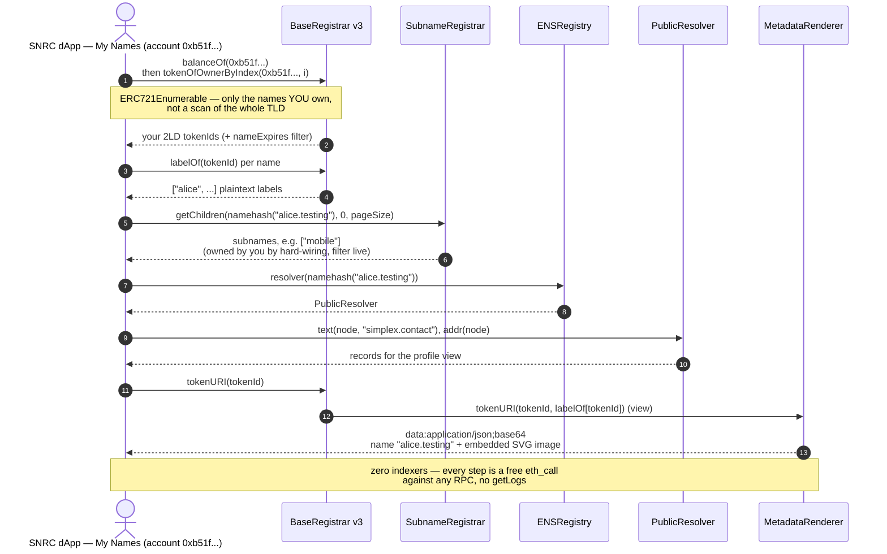
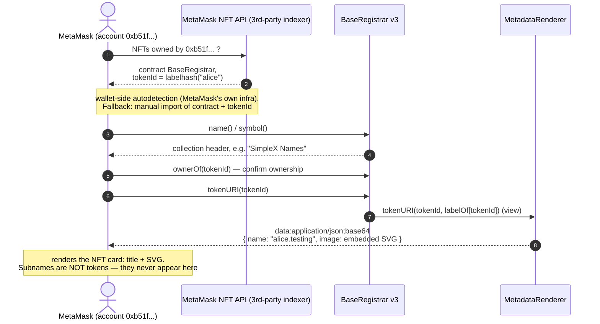

# SNRC happy flows — register, set record, subname, resolve

> Caution: this is not yet exactly as implemented and deployed

Companion to [`architecture-testing-v3.excalidraw`](./architecture-testing-v3.excalidraw)
(same components, wrapper-free v3 design). Flows below: register a bare name, attach the
`simplex.contact` record to a 2LD and (separately) to a subname, create a subname, resolve
the contact from a SimpleX chat client, load the dApp's My Names view, and render the
name-NFT in a generic wallet — all on-chain reads are plain `eth_call`s against any
Ethereum RPC.

## 1 — Register a bare name (commit-reveal, no records yet)

Note: registers with `resolver = 0` — the registrar mints straight to the user and no
registry record is set beyond ownership. The controller passes the **plaintext label** to
`registrar.register(label, …)`, so the registrar stores `labelOf[tokenId]` and maintains
ERC721Enumerable indices at mint — it self-serves hash→name, enumeration, and `tokenURI`/SVG
with no external call. (The dApp can also register with a resolver and records in one
transaction — the controller passes them through `multicallWithNodeCheck`; omitted here for
clarity, as is the optional reverse record.)

_vs ENS:_ the ENS registrar takes the labelhash, stores no plaintext label, and is plain
`ERC721` (not enumerable); hash→name and "My Names" there depend on the subgraph.

## 2 — Set a record on a 2LD (alice.testing)

Note: this is the "edit profile" path — the resolver authorises the caller because the
registry says they own the node. For a 2LD the same two records can instead be written
**atomically inside `register()`**: the controller is a `trustedETHController` on the
resolver, so it may `setResolver` + `setText` in the registration tx (flow 1, records
variant). A subname has no such path (next).

## 2b — Set a record on a subname (mobile.alice.testing) — how it differs

Note: the on-chain mechanism is the same (`setResolver` then `setText`, authorised by the
node's registry owner). Three differences for subnames: the authorised caller is the **2LD
owner** (not a separate subname owner — hard-wired), there is **no atomic
`register()`/trusted-controller path** so records are always a separate owner step after
`createSubname`, and **each node carries its own resolver** so the subname must have one
set even though its parent already does.

## 3 — Create a subname (atomic, owner = parent owner)

Note: subname creation/indexing lives in a dedicated **immutable `SubnameRegistrar`**, not
the controller — clean separation (the controller does only 2LD registration policy) and a
tighter security boundary: the one-time `registry.setApprovalForAll` operator grant goes to
a minimal single-purpose contract whose `createSubname` can *only* ever create a subnode
owned by the caller, so the grant is provably safe. `createSubname` is atomic (create +
index in one tx) and forces the subname owner to be the parent owner. Honest limit: the
verbatim registry cannot *block* a parent from assigning a subname to a third party via a
direct `setSubnodeOwner` call — SNRC defends in depth instead: `submitSubname` (the
permissionless backfill path) refuses to index subnames whose owner differs from the
parent's, `getChildren` consumers filter `owner(sub) == owner(parent)` live, and SimpleX
clients validate the same before trusting a subname's records. Foreign-owned subnames can
exist on-chain but are invisible to and untrusted by SNRC tooling. If a 2LD changes hands,
stale subnames automatically fail the same filter. Because the index is reconstructible from
the registry via `submitSubname`, the contract can be immutable yet replaceable: a fixed
redeploy is re-approved and re-indexed, no data migration. No payment, gate, or expiry
applies to subnames.

_vs ENS:_ ENS lets a parent set a subname to any owner and keeps no on-chain child index
(the subgraph lists subnames); SNRC forces the owner to the parent and indexes children
on-chain via the `SubnameRegistrar`.

## 4 — Resolution (SimpleX chat finds the contact by name)

Note: uses the UniversalResolver one-call path; a client can equally do the two reads
itself — `registry.resolver(node)`, then `resolver.text(node, "simplex.contact")` — which
is what `scripts/resolver/snrc-resolve.py` does.

## 5 — dApp My Names view (indexer-free)

Note: owner→names for **2LDs** is a standard ERC721Enumerable read on the registrar —
`balanceOf` + `tokenOfOwnerByIndex` returns only the names you own (O(names owned), not
O(whole TLD)), always complete because the registrar sees every transfer (it IS the token).
**Subnames** are not tokens, so they live in the `SubnameRegistrar`'s `getChildren` index;
with hard-wired ownership they are owned by the 2LD owner, so My Names finds them by listing
the children of each 2LD you own — no global owner→subname index needed. Cost of the
registrar enumeration: ERC721Enumerable adds ~45k gas per **transfer** (the per-owner index
it maintains). The account's primary name (reverse resolution) is omitted for brevity.

_vs ENS:_ ENS answers "My Names" from the subgraph (the registrar is plain `ERC721`); SNRC
answers it from on-chain reads only, needing just an RPC.

## 6 — Wallet (e.g. MetaMask) renders the name-NFT

Note: a generic wallet doesn't know the SNRC controller ABI, so its *discovery* step runs
through the wallet vendor's own NFT indexer (centralized, outside SNRC's control) or manual
import — only the rendering path (`tokenURI` → data URI with embedded SVG) is trustless.
`tokenURI(tokenId)` lives on the registrar and delegates to the settable `MetadataRenderer`,
passing the stored label; the delegation is internal, so callers see one self-contained
call. Subnames are not tokens, so wallets never list them — by design; they are visible in
the dApp via `getChildren` (flow 5).

The `MetadataRenderer` sits behind a registrar-held pointer, swappable by the multisig via
`setMetadataRenderer` (an auditable on-chain event), so rendering can be fixed without a TLD
redeploy; a label charset enforced on-chain at registration keeps labels from breaking the
JSON/SVG.

_vs ENS:_ ENS renders NFT metadata off-chain via a hosted metadata service (so the image can
change for everyone at once); SNRC renders fully on-chain, and any change is an explicit,
auditable `setMetadataRenderer` transaction.
