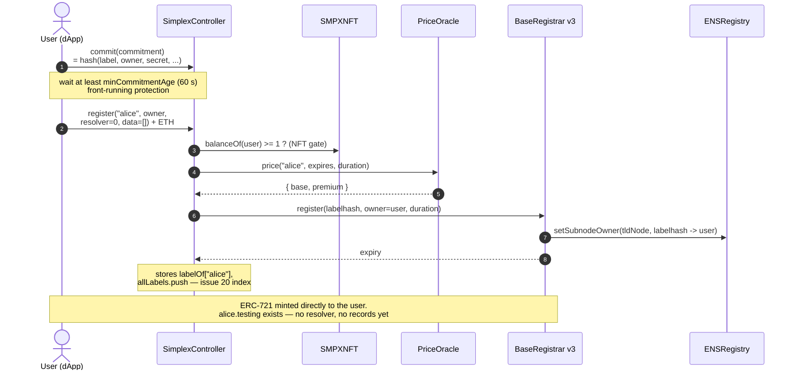
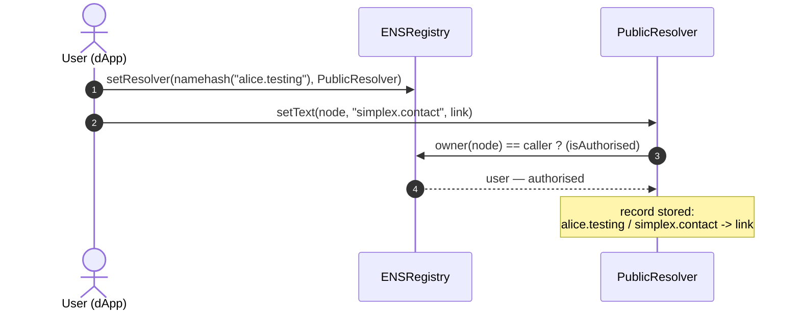
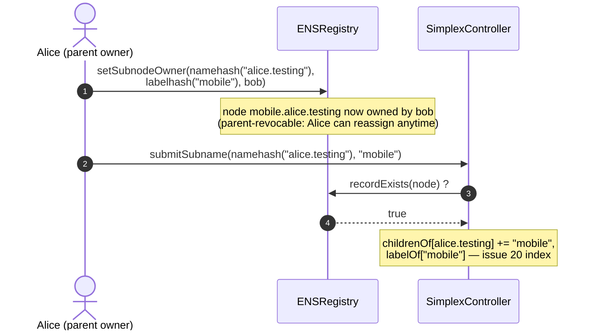
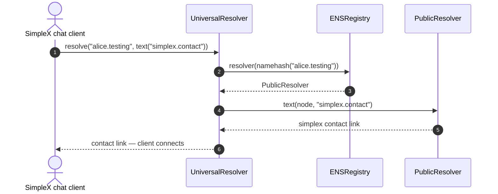
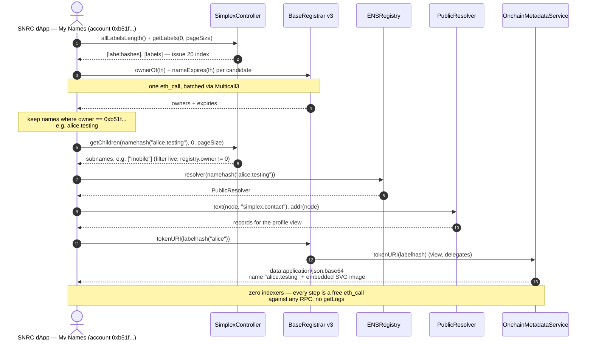
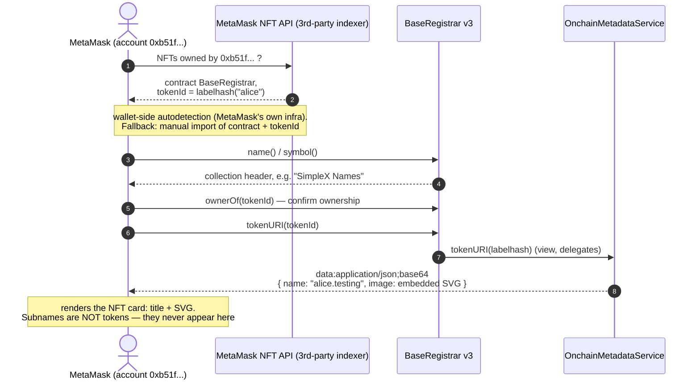

# SNRC happy flows — register, set record, subname, resolve

> Caution: this is not yet exactly as implemented and deployed

Companion to [`architecture-testing-v3.excalidraw`](./architecture-testing-v3.excalidraw)
(same components, wrapper-free v3 design). Six flows: register a bare name, attach the
`simplex.contact` record, create a subname, resolve the contact from a SimpleX chat
client, load the dApp's My Names view, and render the name-NFT in a generic wallet —
all on-chain reads are plain `eth_call`s against any Ethereum RPC.

## 1 — Register a bare name (commit-reveal, no records yet)

## 2 — Set the simplex.contact record

## 3 — Create a subname (no attributes)

## 4 — Resolution (SimpleX chat finds the contact by name)

## 5 — dApp My Names view (indexer-free)

## 6 — Wallet (e.g. MetaMask) renders the name-NFT

Notes:

- Flow 1 registers with `resolver = 0`: the registrar mints straight to the user and no
  registry record is set beyond ownership. (The dApp can also register with a resolver and
  records in one transaction — the controller then passes them through
  `multicallWithNodeCheck`; omitted here for clarity, as is the optional reverse record.)
- Flow 2 is the "edit profile" path: the resolver authorises the caller because the
  registry says they own the node.
- Flow 3 needs no controller, payment, gate, or expiry — subnames are plain registry
  entries created by the parent, revocable by the parent. The `submitSubname` indexing
  step is permissionless and optional-but-recommended (anyone can do it later; the dApp
  chains it automatically).
- Flow 4 uses the UniversalResolver one-call path; a client can equally do the two reads
  itself — `registry.resolver(node)`, then `resolver.text(node, "simplex.contact")` —
  which is what `scripts/resolver/snrc-resolve.py` does.
- Flow 5 is the owner→names question answered without any owner index: the issue-20
  `allLabels` array supplies the complete candidate set and live `ownerOf` filtering
  attributes them — O(total names in the TLD) view reads, batched. The account's primary
  name (reverse resolution via the ReverseRegistrar) is omitted for brevity.
- Flow 6: a generic wallet doesn't know the SNRC controller ABI, so its *discovery* step
  runs through the wallet vendor's own NFT indexer (centralized, outside SNRC's control)
  or manual import — only the rendering path (`tokenURI` → data URI with embedded SVG) is
  trustless. Subnames are not tokens in the wrapper-free design, so wallets never list
  them — by design; they are visible in the dApp via `getChildren` (flow 5).
