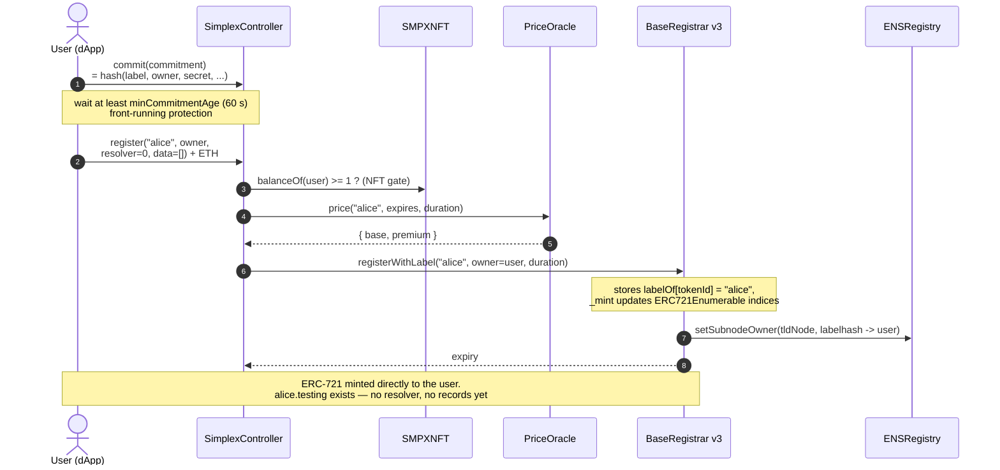
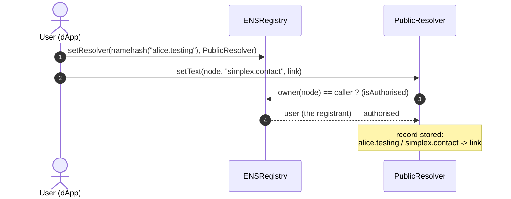
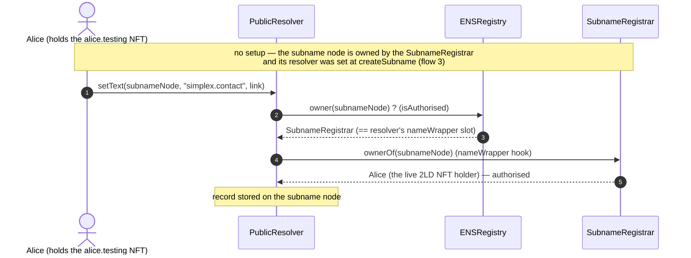
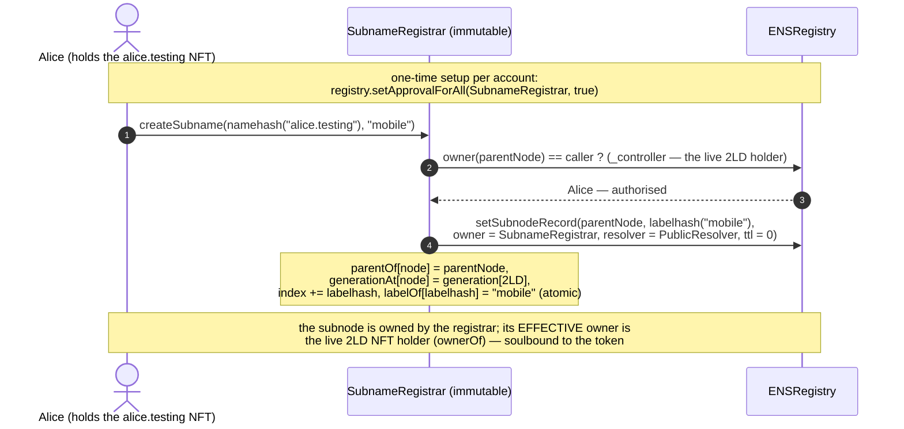
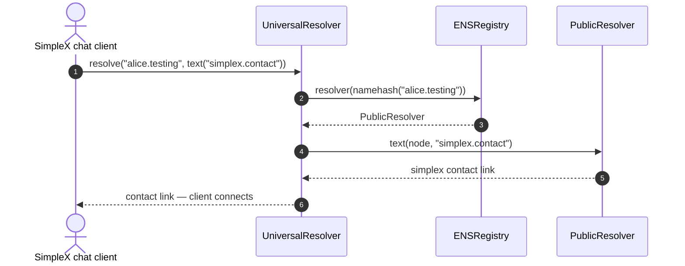
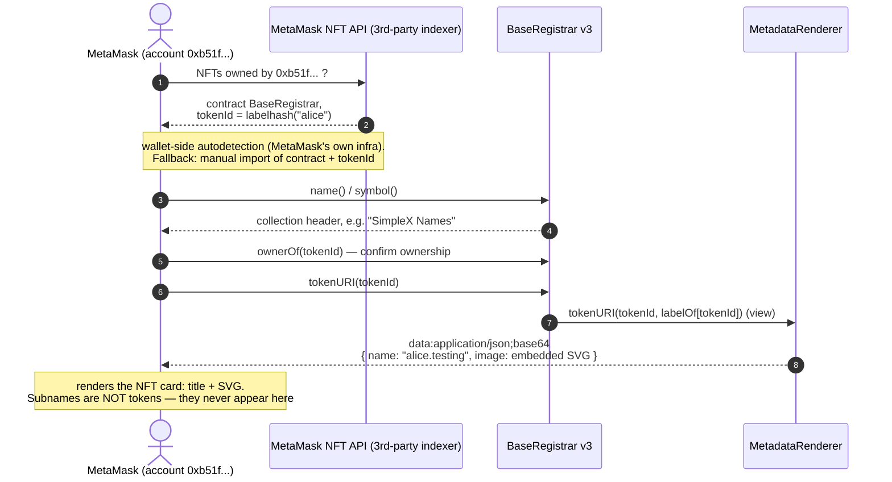
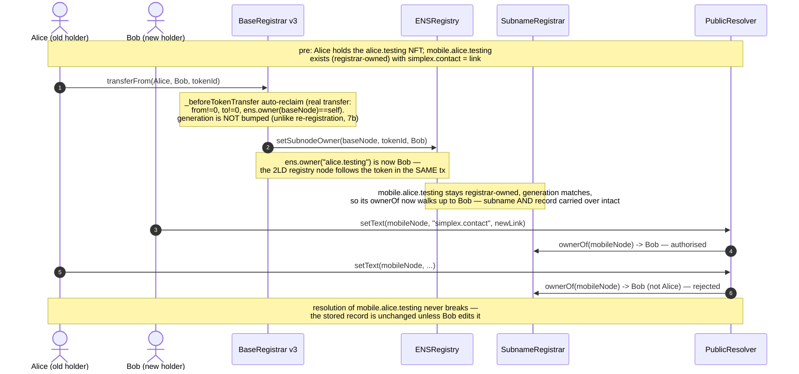
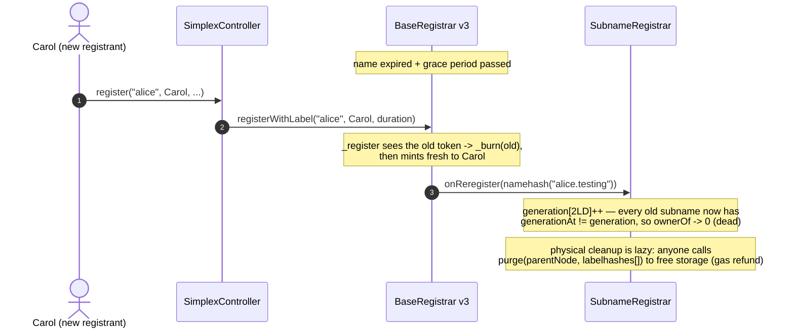
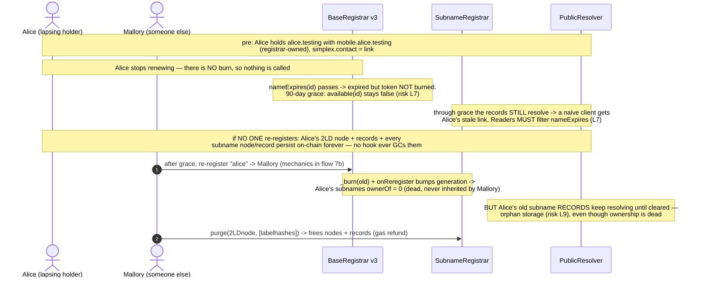

# SNRC happy flows — register, set record, subname, resolve

> Matches the deployed wrapper-free v3 contracts (`.testing` is live on mainnet;
> `.simplex` is not yet deployed).

Companion to [`architecture-testing-v3.excalidraw`](./architecture-testing-v3.excalidraw)
(same components, wrapper-free v3 design). Flows below: register a bare name, attach the
`simplex.contact` record to a 2LD and (separately) to a subname, create a subname, resolve
the contact from a SimpleX chat client, load the dApp's My Names view, render the name-NFT in
a generic wallet, and the two BaseRegistrar→registry hooks (auto-reclaim on transfer,
generation GC on re-registration) that keep soulbound subnames in sync, and a name's
end-of-life (expiry, orphan storage, re-registration by someone else) — all on-chain reads
are plain `eth_call`s against any Ethereum RPC.

Subnames are **soulbound to the 2LD NFT**: the `SubnameRegistrar` owns the subname registry
nodes and derives each effective owner from the live token holder (`ownerOf`), so subnames
follow the token and are never independently transferable (flows 3, 7).

## 1 — Register a bare name (commit-reveal, no records yet)

Note: registers with `resolver = 0` — the registrar mints straight to the user and no
registry record is set beyond ownership. The controller passes the **plaintext label** to
`registrar.registerWithLabel(label, …)`, so the registrar stores `labelOf[tokenId]` and maintains
ERC721Enumerable indices at mint — it self-serves hash→name, enumeration, and `tokenURI`/SVG
with no external call. (The dApp can also register with a resolver and records in one
transaction — the controller passes them through `multicallWithNodeCheck`; omitted here for
clarity, as is the optional reverse record — inert on the live mainnet deploys, where both
reverse registrars are `address(0)`.)

_vs ENS:_ the ENS registrar takes the labelhash, stores no plaintext label, and is plain
`ERC721` (not enumerable); hash→name and "My Names" there depend on the subgraph.

## 2 — Set a record on a 2LD (alice.testing)

Note: this is the "edit profile" path — the resolver authorises the caller because the
registry says they own the node. For a 2LD the same two records can instead be written
**atomically inside `register()`**: the controller is a `trustedETHController` on the
resolver, so it may `setResolver` + `setText` in the registration tx (flow 1, records
variant). A subname has no such path (next).

## 2b — Set a record on a subname (mobile.alice.testing) — how it differs

Note: a 2LD's records authorise *directly* (the registry says the caller owns the node).
A **subname** is owned in the registry by the `SubnameRegistrar`, so the resolver takes its
`nameWrapper` branch — `if (ens.owner(node) == nameWrapper) owner = nameWrapper.ownerOf(node)`
— and `SubnameRegistrar.ownerOf` returns the **live 2LD NFT holder**. So the holder edits
subname records with no extra ownership or resolver step (`createSubname` already set the
resolver). This is the only place the resolver's repurposed `nameWrapper = SubnameRegistrar`
slot is used; the 2LD itself is never wrapped.

## 3 — Create a subname (atomic; registrar-owned, soulbound to the 2LD NFT)

Note: subname creation/indexing lives in a dedicated **immutable `SubnameRegistrar`**, not
the controller — clean separation (the controller does only 2LD registration policy) and a
tighter security boundary: the one-time `registry.setApprovalForAll` operator grant goes to
a minimal single-purpose contract whose only operator-authorised write is
`setSubnodeRecord(parent, label, address(this), …)` — it can *only* create a subnode **owned
by itself**, gated on `_controller(parentNode) == msg.sender` (the live 2LD holder), so the
grant is provably safe. `createSubname` is atomic — it creates the subnode, **sets its
resolver**, and indexes it in one tx. The subnode is registry-owned by the registrar, and its
effective owner is derived on read: `ownerOf` walks `parentOf` up to the 2LD node and returns
that node's registry owner — which the BaseRegistrar **auto-reclaim** hook keeps equal to the
NFT holder (flow 7). So subnames are **soulbound**: they follow the NFT automatically, can't
be sold or assigned to a third party, and the previous holder loses them (and the right to
mint new ones) the instant the token moves. The depth-ready walk-up means subnames of
subnames work the same way (single-level in the UI for now). Because the index is
reconstructible by re-creating subnames, the contract is immutable yet replaceable: a fixed
redeploy is re-approved and re-created, no data migration. No payment, gate, or expiry
applies to subnames; a bumped `generation` (after 2LD re-registration) retires them — flow 7.

_vs ENS:_ ENS lets a parent set a subname to any owner, uses the full NameWrapper
(ERC-1155 + fuses) for emancipated subnames, and keeps no on-chain child index (the subgraph
lists subnames); SNRC uses one minimal contract that owns the nodes and derives ownership
from the 2LD token (no fuses, no ERC-1155) and indexes children on-chain.

## 4 — Resolution (SimpleX chat finds the contact by name)

Note: uses the UniversalResolver one-call path; a client can equally do the two reads
itself — `registry.resolver(node)`, then `resolver.text(node, "simplex.contact")` — the
same two reads any resolver client can make.

## 5 — dApp My Names view (indexer-free)

Note: owner→names for **2LDs** is a standard ERC721Enumerable read on the registrar —
`balanceOf` + `tokenOfOwnerByIndex` returns only the names you own (O(names owned), not
O(whole TLD)), always complete because the registrar sees every transfer (it IS the token).
**Subnames** are not tokens, so they live in the `SubnameRegistrar`'s `getChildren` index;
being soulbound to the 2LD they are owned by whoever holds it, so My Names finds them by
listing the children of each 2LD you own and filtering live on `ownerOf` (which drops
deleted, purged, or generation-dead entries) — no global owner→subname index needed. Cost of the
registrar enumeration: ERC721Enumerable adds ~45k gas per **transfer** (the per-owner index
it maintains). The account's primary name (reverse resolution) is omitted for brevity.

_vs ENS:_ ENS answers "My Names" from the subgraph (the registrar is plain `ERC721`); SNRC
answers it from on-chain reads only, needing just an RPC.

## 6 — Wallet (e.g. MetaMask) renders the name-NFT

Note: a generic wallet doesn't know the SNRC controller ABI, so its *discovery* step runs
through the wallet vendor's own NFT indexer (centralized, outside SNRC's control) or manual
import — only the rendering path (`tokenURI` → data URI with embedded SVG) is trustless.
`tokenURI(tokenId)` lives on the registrar and delegates to the settable `MetadataRenderer`,
passing the stored label; the delegation is internal, so callers see one self-contained
call. Subnames are not tokens, so wallets never list them — by design; they are visible in
the dApp via `getChildren` (flow 5).

The `MetadataRenderer` sits behind a registrar-held pointer, swappable by the multisig via
`setMetadataRenderer` (an auditable on-chain event), so rendering can be fixed without a TLD
redeploy; the renderer JSON/XML-escapes labels (`_jsonEscape` / `_xmlEscape`), so arbitrary
characters can't break the JSON/SVG — there is no on-chain charset restriction.

_vs ENS:_ ENS renders NFT metadata off-chain via a hosted metadata service (so the image can
change for everyone at once); SNRC renders fully on-chain, and any change is an explicit,
auditable `setMetadataRenderer` transaction.

## 7 — Transfer & re-registration (the two BaseRegistrar → registry hooks)

Subnames are soulbound to the 2LD NFT, so ownership has to track the token without anyone
calling `reclaim`. Two `BaseRegistrar` hooks keep the registry in sync automatically — both
fire inside ordinary token operations, no user action.

### 7a — Transfer the 2LD NFT (auto-reclaim — subname + records follow the new holder)

Hook: the **auto-reclaim** override on `_beforeTokenTransfer` re-points the 2LD registry node
to the new holder on every real transfer (it skips mint/burn and no-ops if the registrar
isn't the TLD owner). Because `SubnameRegistrar.ownerOf` derives a subname's owner from this
2LD node, the entire subtree moves with the token atomically — no `reclaim`, no re-seize, no
lazy claim. A plain transfer does **not** bump `generation`, so every subname and its stored
records **carry over to the new holder intact**: Bob can immediately edit
`mobile.alice.testing`'s records (resolver auth via `ownerOf` now returns Bob), Alice can no
longer touch them, and resolution is never interrupted. The previous holder instantly loses
both the subnames and the right to mint new ones (the `_controller` gate now reads Bob).
Contrast flow 7b: a *re-registration* after expiry bumps `generation` and **retires** the old
subtree instead of handing it over. Integrator note: buying a 2LD on the secondary market
inherits the seller's subnames and their records as-is — re-point or clear them if needed.

### 7b — Re-register an expired 2LD (onReregister — generation GC)

Hook: on a re-registration, `_register` calls `subnameRegistrar.onReregister(2LDnode)` (only
the BaseRegistrar may call it), which bumps a per-2LD `generation` counter. Each subname
stored its `generationAt` at creation, so the bump invalidates them all **at once and
immediately**: `ownerOf` returns `address(0)`, the dApp stops listing them, and no one can
edit them — Carol starts from a clean slate and must `createSubname` afresh. Their stored
resolver records, however, keep resolving until the registry/resolver storage is cleared,
because you can't delete an unbounded set of subnames inside the registration tx. Cleanup is
therefore a permissionless, batched `purge(parentNode, labelhashes[])` (storage-refund
incentivised; the dApp can `purge` on acquisition) — the records-leak-until-purge risk
accepted as L9 in [`security.md`](./security.md), matching how plain ENS leaves an expired
name's subnames lingering.

_vs ENS:_ ENS relies on the NameWrapper's fuses/expiry to expire emancipated subnames and on
`reclaim` to re-sync registrant↔registry; SNRC needs neither — auto-reclaim keeps them in
sync on transfer, and a single `generation` bump retires a whole subtree on re-registration.

## 8 — End-of-life: expiry, orphan storage & re-registration by someone else

A name ends by **expiry**, not by burning — there is no voluntary burn (flow 7's hooks fire
only on transfer or re-registration). This is the lapse-and-let-go path, and it leaves two
kinds of orphan storage.

End-of-life is **expiry**, not a burn. SNRC has no voluntary burn or relinquish — `renew`
extends a name, and a holder ends one simply by letting it lapse. Two orphan-storage risks
follow, both accepted in [`security.md`](./security.md):

- **L7 — expired-but-unburned.** The ERC-721 token is burned only by the *next* registration,
  never by expiry itself, so a lapsed name's token, its 2LD record, and all its subnames keep
  resolving through the 90-day grace period and indefinitely afterwards. Every reader (the
  dApp, resolver clients, integrators) MUST gate on `nameExpires(id) > block.timestamp` —
  otherwise it serves the lapsed owner's stale contact link as if current.
- **L9 — records-leak-until-purge.** When *someone else* finally re-registers (flow 7b), the
  `onReregister` hook bumps `generation`, so the previous owner's subnames die at the
  ownership level immediately — `ownerOf` returns `address(0)`, the dApp stops listing them,
  and the new owner never inherits them. But their stored resolver records keep resolving
  until storage is cleared (you can't delete an unbounded subtree inside the registration tx).
  Cleanup is the permissionless, batched `purge(parentNode, labelhashes[])` — storage-refund
  incentivised, and the dApp purges on acquisition.

If a lapsed name is **never** re-registered, nothing ever triggers GC: its 2LD record and
entire subname subtree sit on-chain forever (the same as plain ENS — only a re-registration
fires the `generation` bump). The new owner, when there is one, inherits a clean ownership
slate (a fresh `createSubname` is required to reuse any label) but sees the old records linger
until `purge`.

_vs ENS:_ ENS wraps subnames with their own fuse/expiry so they can self-expire; SNRC
subnames have no independent expiry — they live and die with the 2LD's `generation`, leaving
only records-until-`purge` as the orphan to sweep.
